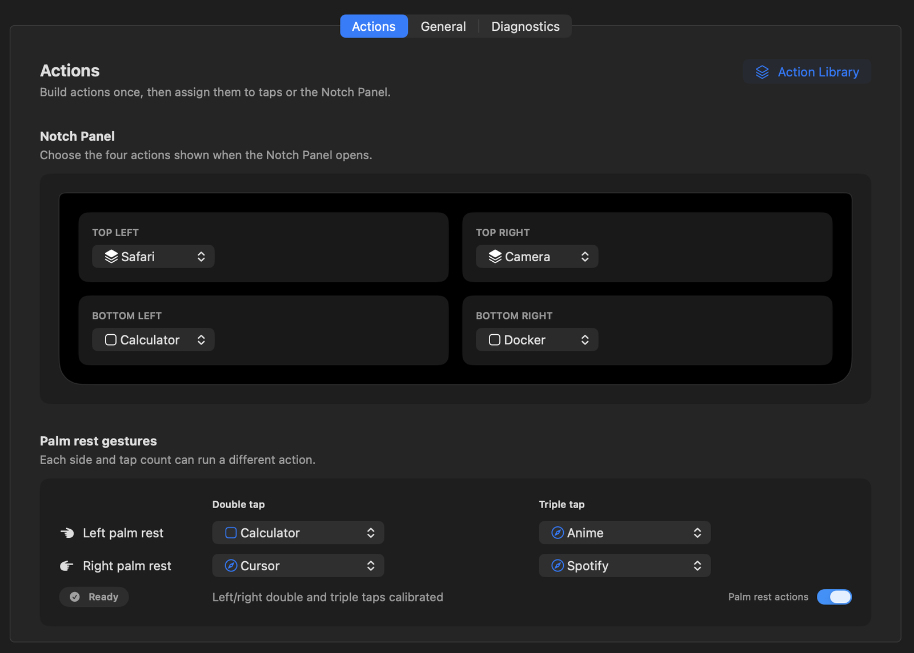

# Mactivate

Mactivate uses the accelerometer, gyroscope, and ambient-light sensor built into Apple Silicon MacBooks to turn physical gestures into macOS controls. Double and triple taps on the left or right palm rest can trigger actions like launching an application, opening a web address, or running a Shortcut. Moving a hand near the camera can reveal the Notch Panel, a four-control surface attached to the notch.

> Compatibility: macOS 13+ on Apple Silicon MacBooks. Validated on a MacBook Air M2 running macOS 26.2.

<details open>
<summary><h2>Product walkthrough <sub>click to toggle</sub></h2></summary>

### Notch Panel

Hover your hand near the notch area to reveal a passive hint, then click it to open the Notch Panel. You can also click the Mactivate icon in the menu bar to open the panel directly.


### Notch Hover

Notch Hover is on by default and responds to ambient-light changes. Its status and toggle are available under **General**, and it never runs an action directly.


### Calibration

Open **Actions → Palm tap setup**. Step 1 records comfortable and firm single taps on each palm rest and requires **Save Step 1**. Step 2 records guided left and right double and triple taps, then saves automatically.


### Tap and gesture mapping

Create application, web-link, or Shortcut actions, then assign them to left double, left triple, right double, and right triple taps. The same Actions pane also assigns actions to the four Notch Panel slots.



### Diagnostics

Open **Diagnostics** to review the latest tap decision, including peak strength, detected impact count, and rejection detail when available. The runtime report below it can be copied for troubleshooting.


</details>

## Install

Install Mactivate with Homebrew or from the release disk image.

### Homebrew

```bash
brew tap HarshitBadam/mactivate
brew trust --cask HarshitBadam/mactivate/mactivate
brew install --cask mactivate
```


### Disk image

Download the latest `.dmg` from [GitHub Releases](https://github.com/HarshitBadam/mactivate/releases), open it, and drag Mactivate into Applications.

Mactivate uses a zero-cost, ad-hoc-signed release and is not Apple-notarized. If macOS blocks the first launch, try to open Mactivate once, then approve it under **System Settings → Privacy & Security → Open Anyway**. Do not disable Gatekeeper.

Open Mactivate from Applications, complete tap and left/right calibration, then assign actions to the four supported gestures and four Notch Panel slots.

## Build from source

```bash
git clone https://github.com/HarshitBadam/mactivate.git
cd mactivate
open app/MactivateApp.xcodeproj
```

Run the shared `MactivateApp` scheme. Package and test commands are documented in the area READMEs below.

---


## Repository

- [app/](app/): Native menu-bar application, Notch Panel, Configuration Window, calibration, and app tests
- [packages/](packages/): Production sensor, hardware, and runtime Swift packages
- [research/](research/): Offline fitting, evaluation, capture, and hardware diagnostics
- [tools/](tools/): Analysis and repository maintenance utilities
- [docs/](docs/): Architecture and measured product validation

Start with the [system overview](docs/architecture/system-overview.md) for the runtime flow or [product validation](docs/validation/product-validation.md) for the evidence behind the interaction.

## License

This project is licensed under the [PolyForm Noncommercial License 1.0.0](LICENSE).