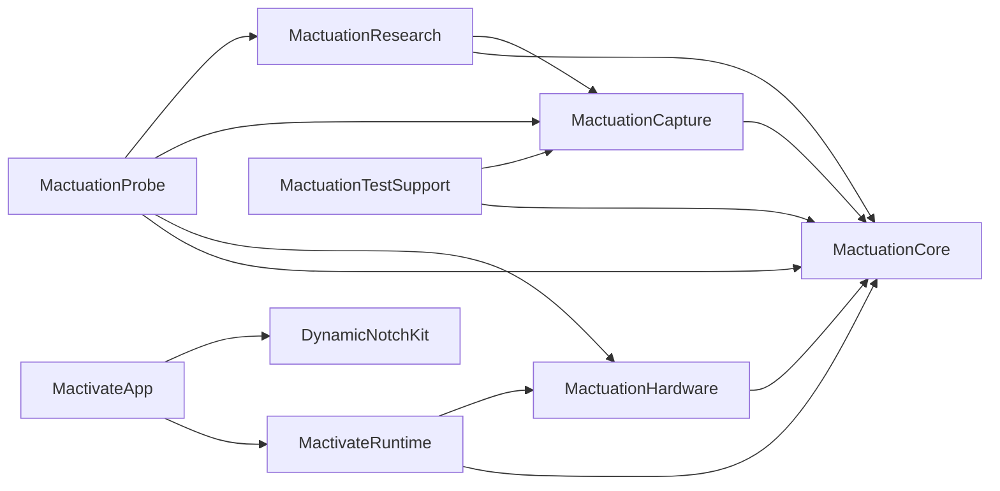

# Repository structure

Production code, research code, tools, and evidence are separated at the top level.

## Repository map

```text
.
├── app/
│   ├── MactivateApp.xcodeproj/       # Xcode project and package lockfile
│   ├── MactivateApp/
│   │   ├── App/                     # lifecycle, state, and runtime bridge
│   │   ├── Actions/                 # application, URL, Shortcut, and Notch Panel
│   │   ├── Lifecycle/               # launch at login
│   │   ├── MenuBar/                 # menu bar item and manual Notch Panel entry
│   │   ├── Panel/                   # notch and top-center panel presentation
│   │   ├── Preferences/             # app settings persistence
│   │   ├── Resources/               # asset catalog
│   │   └── Settings/                # Configuration Window, onboarding, and calibration
│   └── MactivateAppTests/            # app and integration tests
├── packages/
│   ├── core/
│   │   ├── Sources/
│   │   │   ├── MactuationCore/      # sensor contracts and classifiers
│   │   │   ├── MactuationHardware/  # macOS IOKit adapters
│   │   │   ├── MactuationCapture/   # capture storage and replay
│   │   │   └── MactuationTestSupport/ # mocks and deterministic test support
│   │   └── Tests/                   # core package tests and fixtures
│   └── runtime/
│       ├── Sources/MactivateRuntime/ # configuration, persistence, routing, and lifecycle
│       └── Tests/                   # runtime tests
├── research/
│   ├── analysis/                    # offline fitting and capture evaluation
│   └── probe/                       # hardware discovery and capture CLI
├── tools/
│   ├── analysis/                    # Python IMU analysis and rule scoring
│   ├── hardware/                    # daemon context diagnostics
│   └── maintenance/                 # repository policy checks
├── docs/
│   ├── architecture/                # system and repository design
│   └── validation/                  # measured hardware and gesture results
├── captures/                        # local sensor evidence, gitignored
├── LICENSE                          # PolyForm noncommercial license
└── README.md                        # project overview
```

## Dependencies



The app depends directly on Runtime and DynamicNotchKit. Runtime uses Core and Hardware. Capture, TestSupport, Research, and Probe do not ship with the app.

## Repository check

Run this from the repository root to verify the layout, file and directory limits, module boundaries, and package dependencies.

```bash
python3 tools/maintenance/check_repository.py
```
