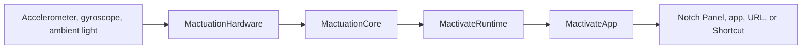

# System overview

Mactivate converts MacBook sensor samples into Notch Panel requests and configured actions.

## Runtime flow

1. `MactuationHardware` reads sensor data through macOS IOKit adapters.
2. `MactuationCore` classifies tap groups, left or right regions, and ambient-light Notch Panel requests.
3. `MactivateRuntime` applies calibration, settings, lifecycle state, and action bindings.
4. `MactivateApp` presents the menu bar item, Notch Panel, onboarding, calibration, and Configuration Window.
5. The action layer opens the Notch Panel, opens an application or web address, or runs a macOS Shortcut.

## Interfaces

- The **Notch Panel** is the main action surface. It attaches to the notch or appears at the top center on displays without one.
- **Notch Hover** uses ambient-light changes to open the Notch Panel.
- The **Configuration Window** contains actions, calibration, diagnostics, and preferences.
- The **menu bar item** opens the Notch Panel and provides access to the Configuration Window.

## Tap handling

The accelerometer detects and groups palm-rest impacts. Accepted single taps remain diagnostic. Accepted double and triple taps continue to left or right classification using gyroscope data and the user's calibration. Runtime dispatches an action only when the tap count, side, calibration, binding, and event identity are valid. Missing, stale, or near-boundary data produces no action.

## Hover handling

Notch Hover can open the Notch Panel. It cannot run an action. The menu bar item provides manual access.

## Lifecycle

Sensor work runs off the main thread. Runtime rejects stale callbacks, duplicate events, and unresolved gestures during stop or sleep. Hardware adapters restore modified sensor properties when acquisition ends.

## Shipping boundary

The app ships with Runtime, Core, Hardware, and DynamicNotchKit. Capture, test support, model fitting, and hardware probe code remain outside the app.