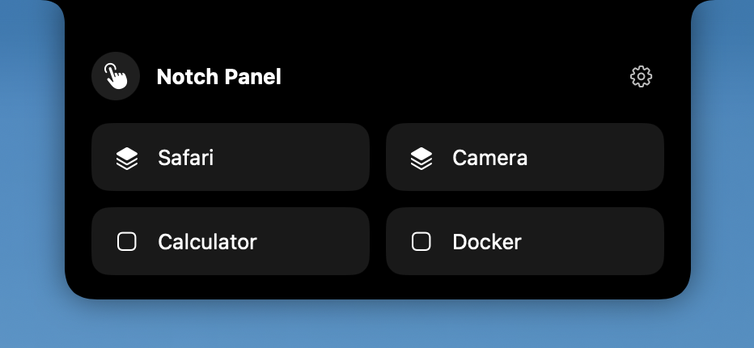
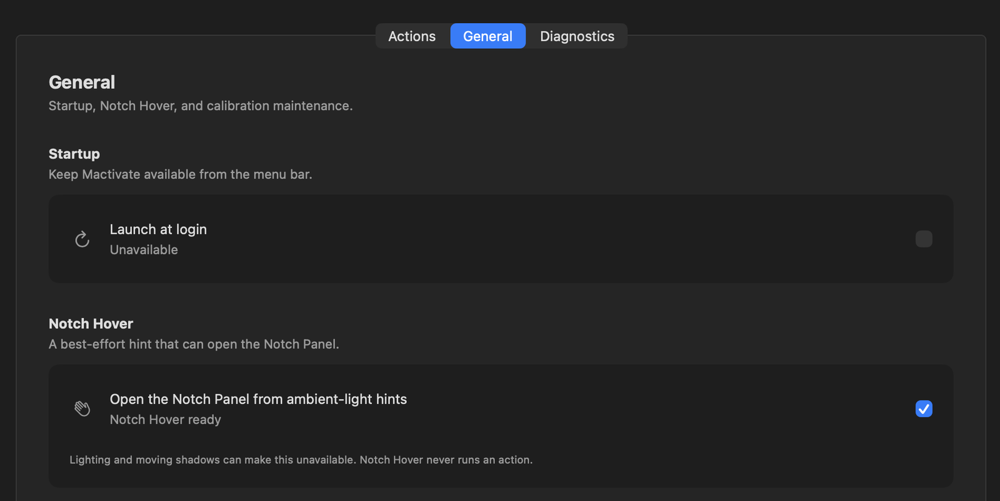
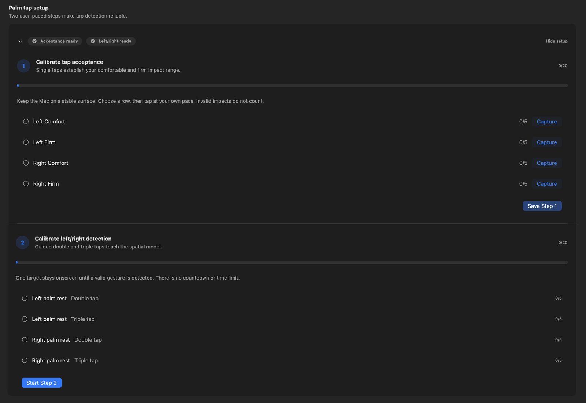
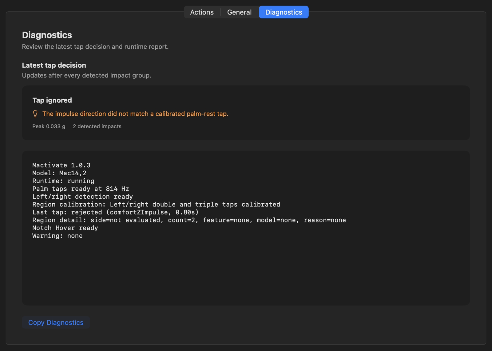

# Product walkthrough

Mactivate is configured from its menu-bar item and Configuration window. Complete calibration before assigning palm-rest gestures.

## 1. Notch Panel

Hover your hand near the notch area to reveal a passive hint, then click it to open the Notch Panel. You can also click the Mactivate icon in the menu bar to open the panel directly.

## 2. Notch Hover

Notch Hover is on by default and responds to ambient-light changes. Its status and toggle are available under **General**, and it never runs an action directly.

## 3. Calibration

Open **Actions → Palm tap setup**. Step 1 records comfortable and firm single taps on each palm rest and requires **Save Step 1**. Step 2 records guided left and right double and triple taps, then saves automatically.

## 4. Tap and gesture mapping

Create application, web-link, or Shortcut actions, then assign them to left double, left triple, right double, and right triple taps. The same Actions pane also assigns actions to the four Notch Panel slots.

## 5. Diagnostics

Open **Diagnostics** to review the latest tap decision, including peak strength, detected impact count, and rejection detail when available. The runtime report below it can be copied for troubleshooting.

For installation and first launch, see the root README's [Install section](../README.md#install).
